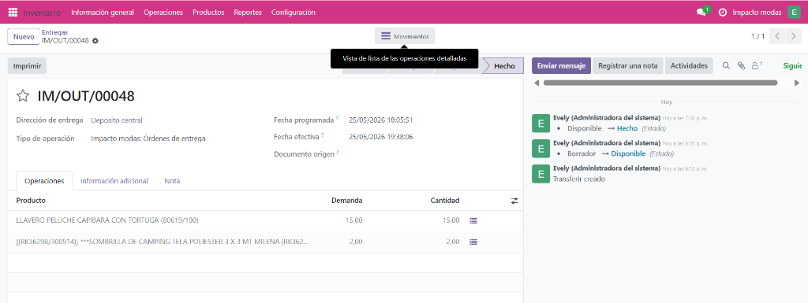
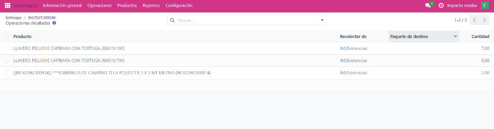
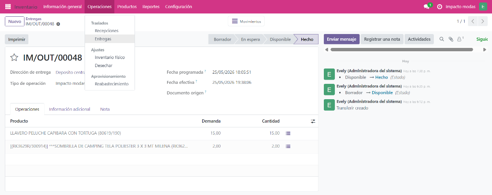
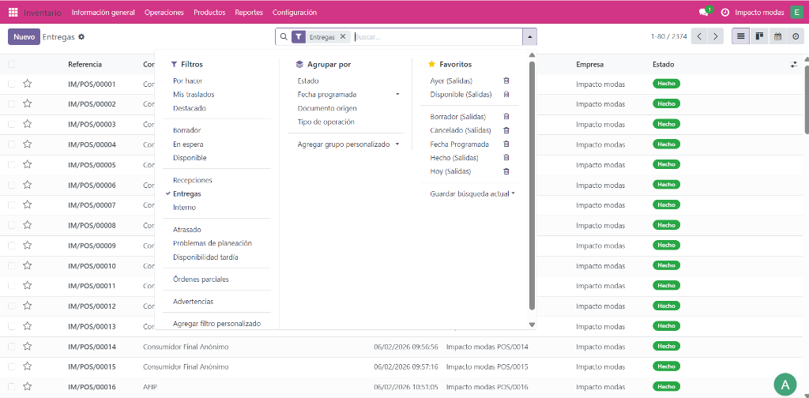
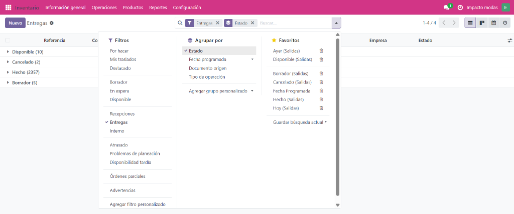
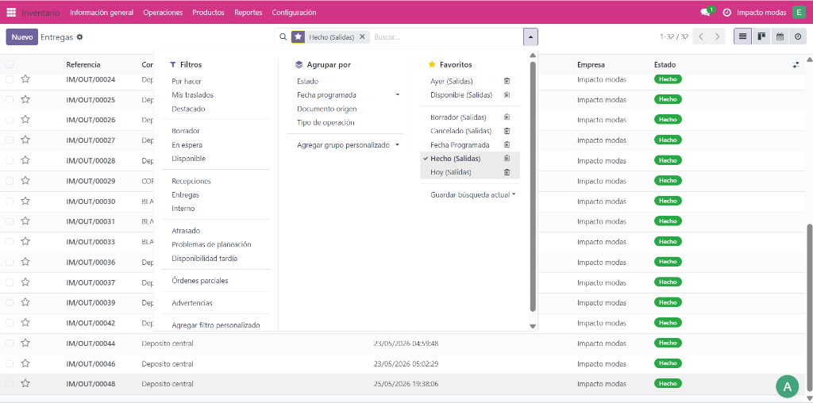
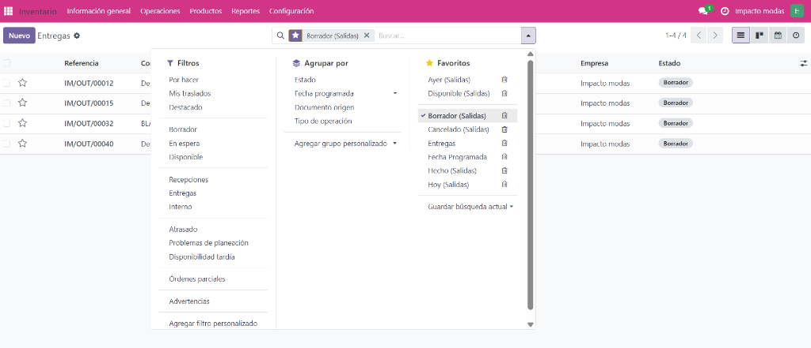
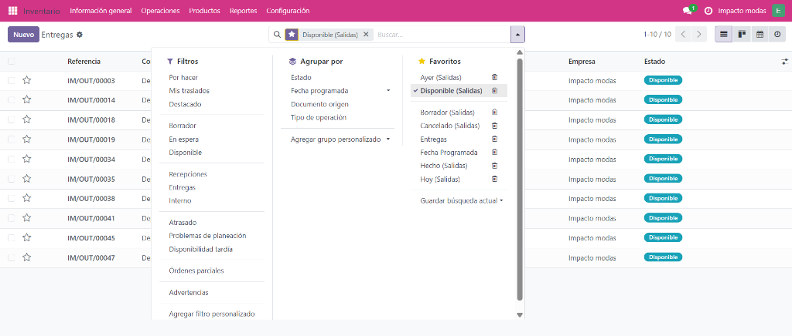

## 1.2 Consultar Entregas (Búsqueda y Filtros)

Para realizar auditorías de remitos, comprobar estados o buscar envíos anteriores, sigue estos pasos:

1. **Auditar los Movimientos del Remito**: Desde la ficha de un remito en estado *Hecho*, haz clic en el botón **Movimientos** en la barra superior.
   
   

2. **Revisar Operaciones Detalladas**: En la pantalla de *Operaciones detalladas*, podrás ver de qué ubicaciones de existencias salió cada bulto y la cantidad física cargada.
   
   

3. **Retornar al Listado General**: Para regresar a la grilla de todos los remitos, ve al menú superior **Operaciones** y selecciona **Entregas**.
   
   

4. **Acceder a Filtros y Agrupadores**: Haz clic en el ícono de filtro en el cuadro de búsqueda superior para abrir el menú de parámetros de visualización.
   
   

5. **Agrupar por Estado**: Haz clic en **Estado** en la columna central *Agrupar por*. Verás cómo la grilla se clasifica dinámicamente en carpetas según el estado (*Disponible*, *Cancelado*, *Hecho*, *Borrador*).
   
   

6. **Filtrar por Favoritos: Hecho (Salidas)**: Bajo la columna *Favoritos*, haz clic en **Hecho (Salidas)** para que la lista muestre exclusivamente remitos completados.
   
   

7. **Filtrar por Favoritos: Borrador (Salidas)**: Haz clic en **Borrador (Salidas)** en Favoritos para ver remitos pendientes de confirmar.
   
   

8. **Filtrar por Favoritos: Disponible (Salidas)**: Haz clic en **Disponible (Salidas)** en Favoritos para aislar los remitos que ya tienen mercadería reservada y están a la espera de ser validados.
   
   
