## 2.3 Guía de Procesamiento de los 16 Métodos de Pago

A continuación se detalla cómo procesar el cobro utilizando cada uno de los 16 medios de pago habilitados. Cada método cuenta con un icono específico en el panel de pagos del POS:

### 1. Cobro en Efectivo
*  **Efectivo**
* 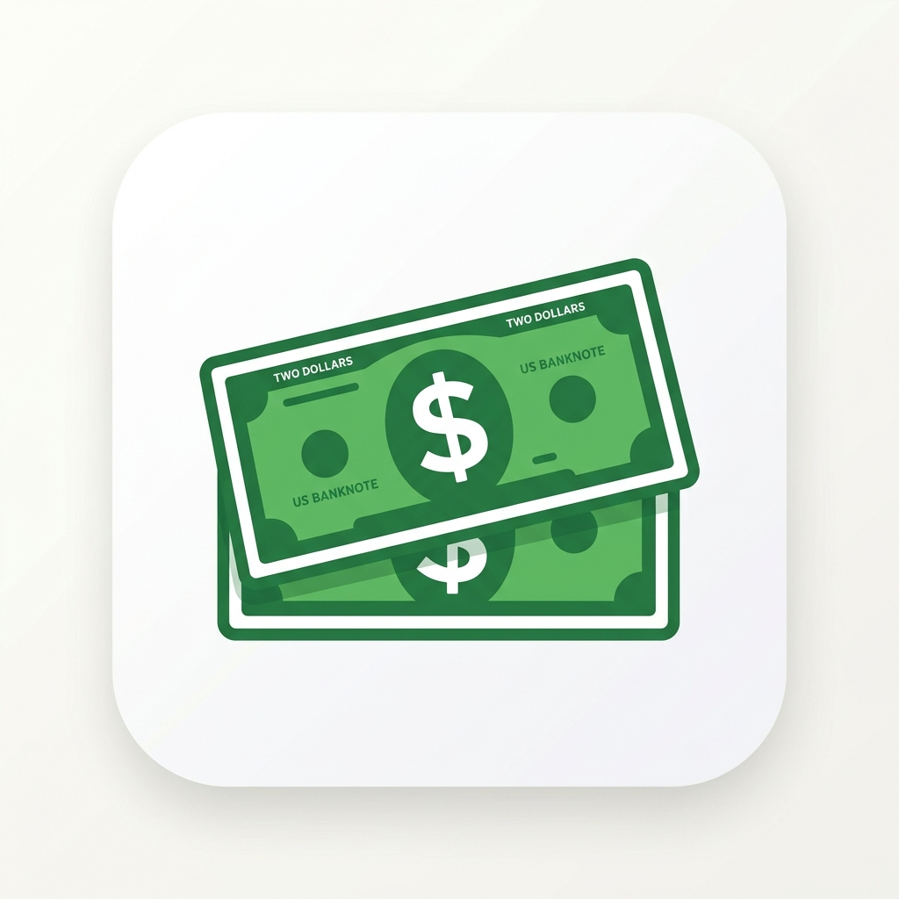 **Efectivo Caja 2** (Para operaciones en la caja secundaria)
* **Procedimiento**:
  1. Selecciona el botón **Efectivo** (o **Efectivo C2** si trabajas en la segunda caja).
  2. Digita el monto en efectivo entregado por el cliente usando el teclado numérico. Es el
     **importe que te entrega la persona**, no el total de la venta: si la compra es de $18.000 y el
     cliente paga con $20.000, se carga **20000**.
  3. El sistema calculará el vuelto a entregar en la esquina superior derecha (*Vuelto*). En el
     ejemplo anterior, $2.000.
  4. Presiona **Validar** para emitir el ticket fiscal y abrir el cajón físico. Se imprime el
     comprobante para el cliente.

---

### 2. Cobros con Tarjetas de Débito
* 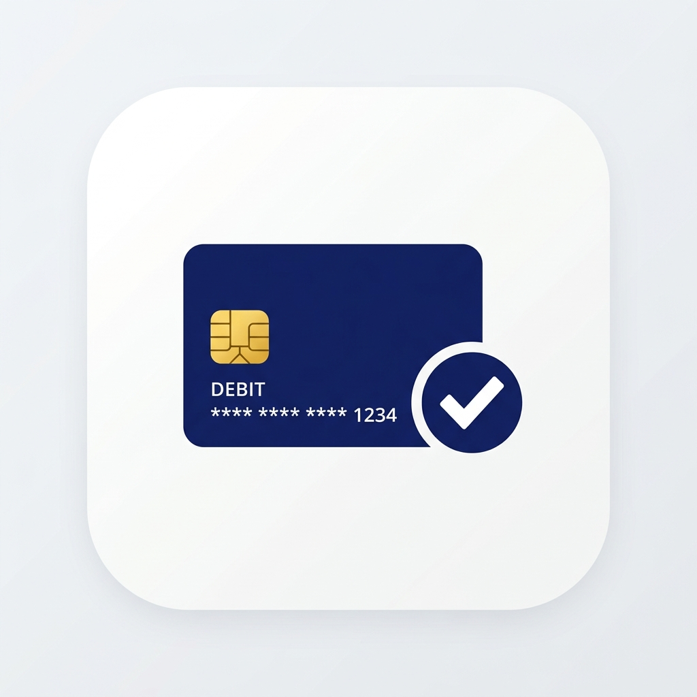 **Débito (Genérico)**
* 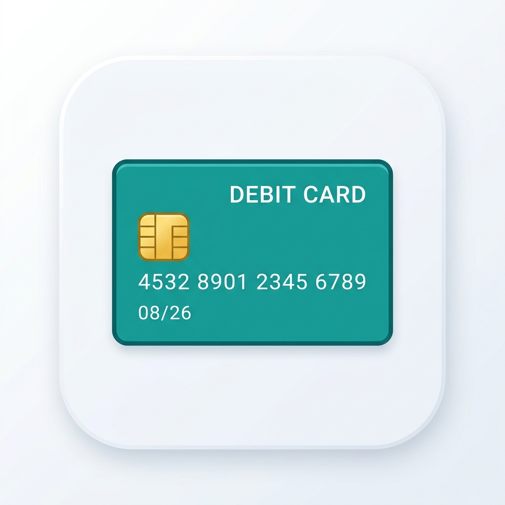 **Tarjeta Débito (Posnet)**
* **Procedimiento**:
  1. Selecciona el método de pago correspondiente.
  2. Pasa la tarjeta del cliente por la terminal Posnet/Lapopos física de la sucursal.
  3. Una vez aprobada la transacción en la terminal física, escribe las últimas 4 cifras del comprobante impreso en el campo de **Referencia** en Odoo.
  4. Presiona **Validar** en Odoo para archivar el cobro.

---

### 3. Cobros con Tarjetas de Crédito y Planes Locales
* 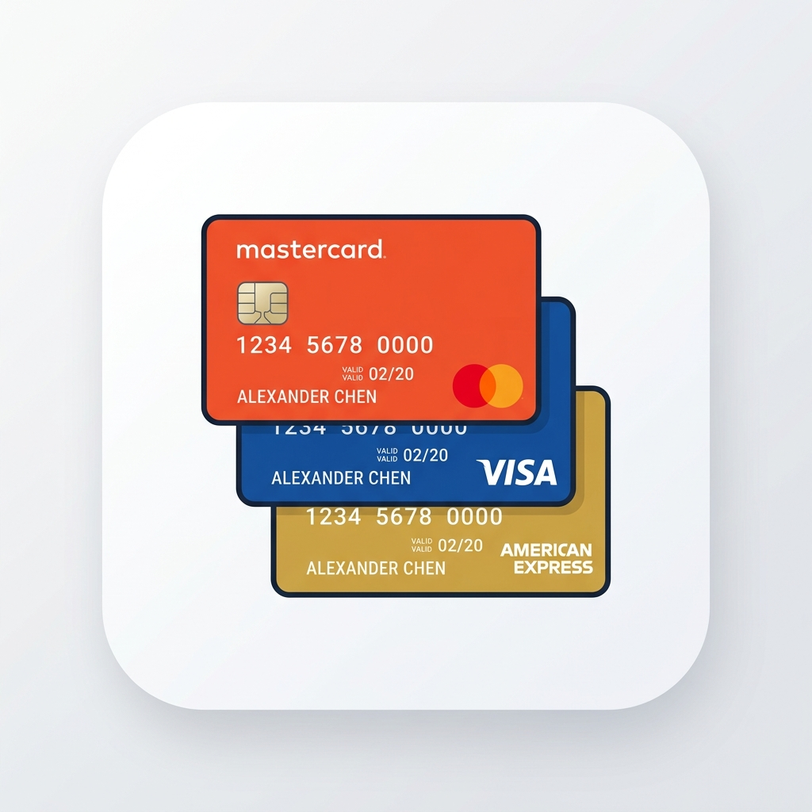 **Tarjetas de Crédito**
* 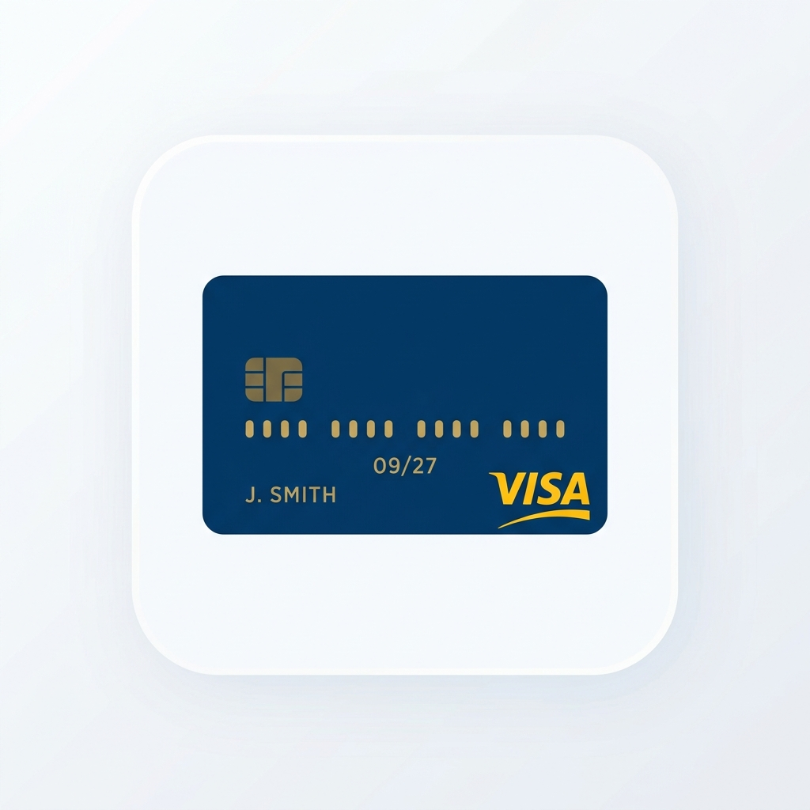 **Visa Crédito**
* 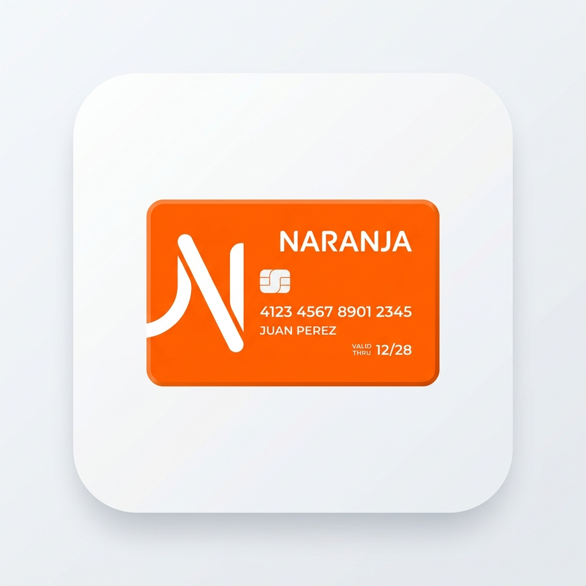 **Tarjeta Naranja**
* 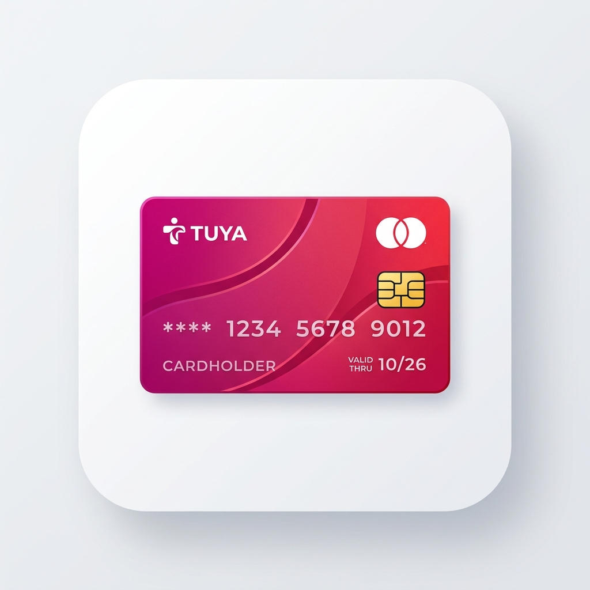 **Tarjeta Tuya (Banco del Chaco)**
* **Procedimiento**:
  1. Presiona **Pagar** y selecciona el botón de la tarjeta específica según la marca del plástico
     del cliente.
  2. **Seleccionar el plan de cuotas:** al elegir una tarjeta de crédito, Odoo detecta que tiene
     planes de cuotas disponibles. Presiona el botón **Cuotas** (ícono de tarjeta, en el panel de
     botones de la pantalla de pago). Se abre la ventana *Cuotas* con la lista de planes; cada
     opción muestra el **Importe** final y el **Cargo** (recargo financiero) que corresponde.
     Marca el plan que el cliente eligió y presiona **Ok**.
  3. **Confirmación visual:** en la esquina inferior derecha de la pantalla de pago hay un cartel
     **PLAN DE CUOTAS**. Mientras diga *Sin seleccionar* (en amarillo) todavía no elegiste plan;
     una vez seleccionado pasa a verde e indica la cantidad de cuotas. Si el plan tiene recargo,
     se agrega automáticamente a la venta como una línea adicional.
  4. **Procesar en el Posnet:** pasa la tarjeta y realiza la transacción en la terminal física con
     el mismo plan de cuotas que seleccionaste en Odoo.
  5. **Registrar la referencia:** en el campo **Referencia de pago** escribe los últimos números
     del comprobante o de la transacción del Posnet, como control para el arqueo.
  6. Verifica en la pantalla principal que figure el plan de cuotas seleccionado y presiona
     **Validar** para consolidar el ticket.

> **Importante:** el recargo que cobra Odoo sale del plan que seleccionaste en la ventana *Cuotas*.
> Si en la terminal física procesas un plan distinto, el importe cobrado al cliente no coincidirá
> con el registrado en el sistema.

---

### 4. Cobros Digitales y QR
*  **MercadoPago**
* **Procedimiento**:
  1. Selecciona el botón **MercadoPago**.
  2. Muestra al cliente el código QR de cobro de la sucursal (en pantalla o impreso).
  3. El cliente escanea el QR desde su celular y confirma la transacción.
  4. **Verificación de Seguridad Obligatoria**: Antes de continuar en Odoo, verifica en el teléfono/tablet de la sucursal que el pago ingresó de forma efectiva y que el nombre del pagador coincide con el cliente.
  5. En Odoo, digita el número de **Operación de MercadoPago** y haz clic en **Validar**.

---

### 5. Transferencias y Operaciones Bancarias
*  **Banco / Transferencia**
* **Procedimiento**:
  1. Entrega los datos del CBU/Alias bancario de la empresa al cliente para que realice la transferencia bancaria inmediata.
  2. Solicita el comprobante digital o físico emitido por la entidad bancaria del cliente.
  3. Confirma el ingreso en el Home Banking de la empresa si posees acceso o solicita la confirmación telefónica al Depósito Central.
  4. En Odoo, selecciona el botón **Banco** e introduce en la referencia el número de transacción bancaria. Presiona **Validar**.

---

### 6. Financiación Especial y Créditos Personales
* 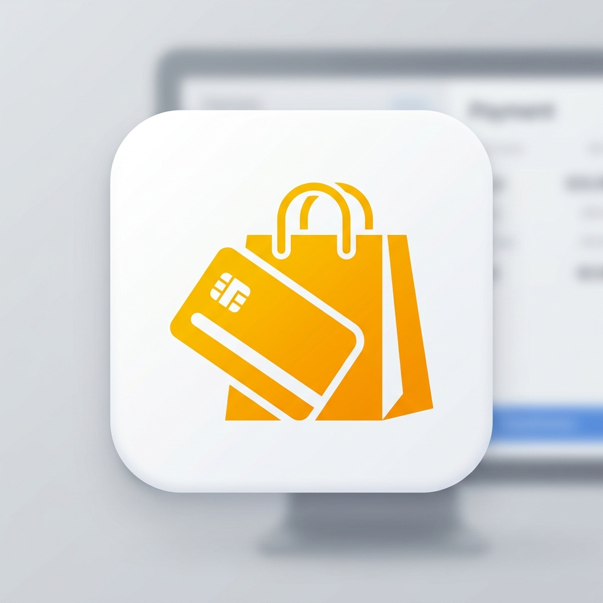 **Credicompras**
* 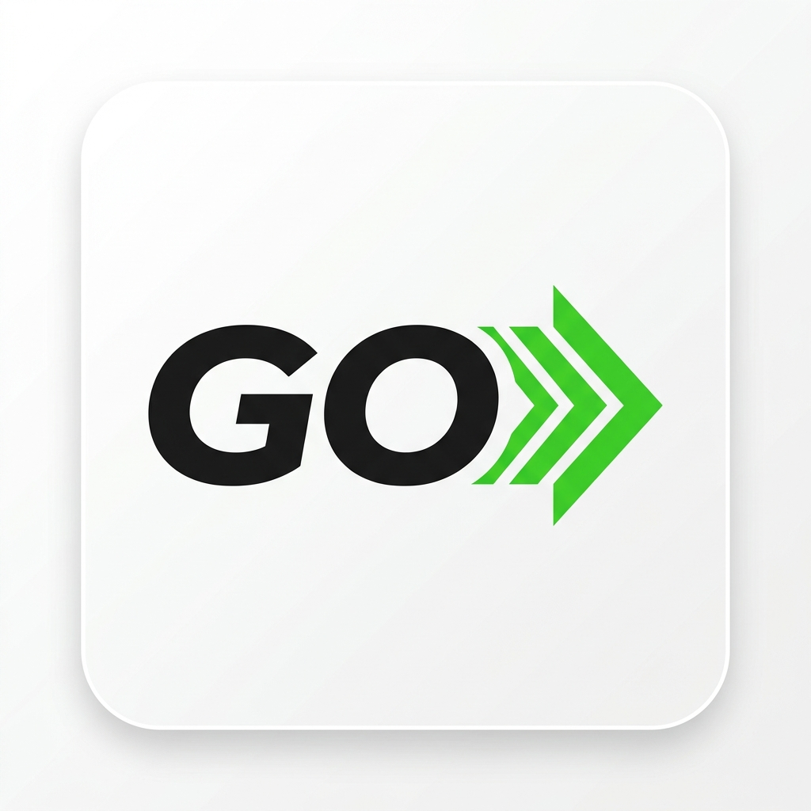 **Go Cuotas (Débito en Cuotas)**
* 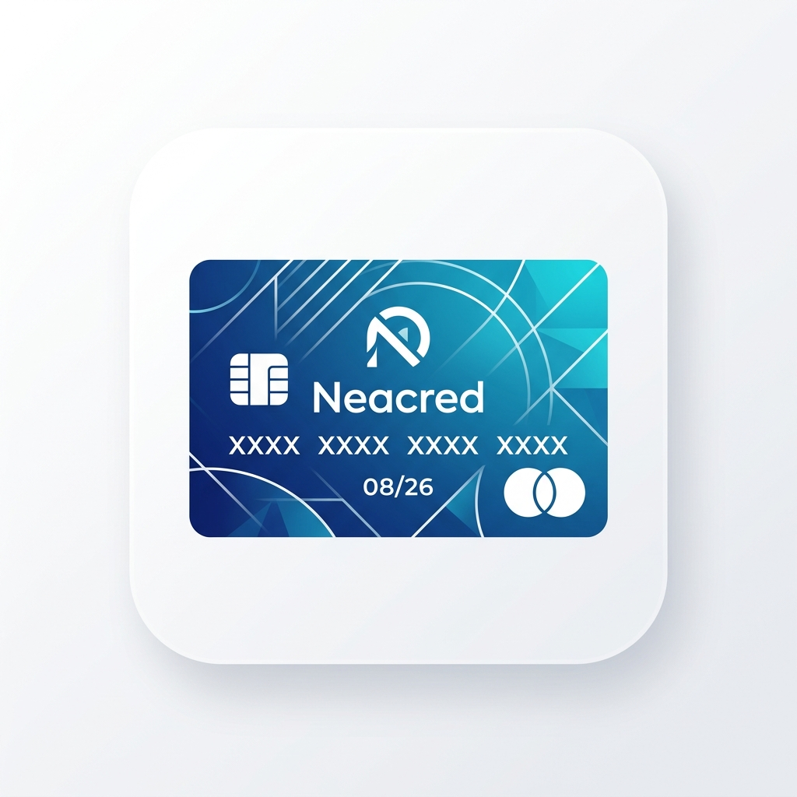 **Neacred**
* 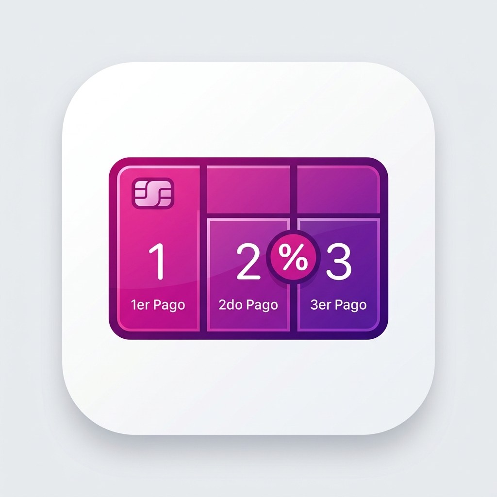 **Planes Ahora Cabal**
* **Procedimiento**:
  1. Selecciona el método de financiación correspondiente.
  2. Ingresa a la plataforma externa del proveedor de crédito (ej. portal de Go Cuotas o Neacred).
  3. Ingresa el DNI y celular del cliente en la plataforma externa para autorizar el cobro en cuotas.
  4. Una vez aprobado el crédito en el portal externo, vuelve a Odoo, escribe el código de autorización otorgado por la plataforma en el campo de referencia de Odoo, y presiona **Validar**.

---

### 7. Cheques
* 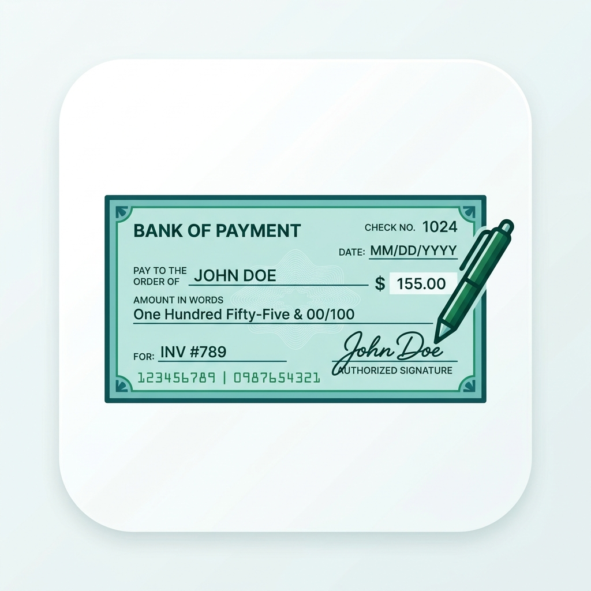 **Cheque**
* **Procedimiento**:
  1. Haz clic en **Cheque** en el POS.
  2. Inspecciona físicamente el documento de cheque. Asegúrate de verificar firmas, montos en números y letras, y la fecha de cobro futura.
  3. En la referencia del pago en Odoo, registra los datos vitales: **Banco de origen + Número de Cheque + CUIT del firmante**.
  4. Presiona **Validar** para cerrar la venta. Guarda el cheque físico en la caja fuerte de la sucursal.

---

### 8. Venta A Crédito (Cuenta Corriente)
*  **Cuenta Cliente (Cuenta Corriente)**
* **Procedimiento**:
  1. **Requisito indispensable**: Asegúrate de haber asociado previamente un Cliente en el paso 2.2.
  2. Presiona el botón **Cuenta Cliente**.
  3. Odoo verificará si el cliente posee un límite de crédito aprobado y saldo disponible suficiente para cubrir la venta.
  4. Si cumple los requisitos, presiona **Validar**. La compra se cargará al saldo deudor de la ficha del cliente en Odoo para su posterior facturación y cobro mensual.

---
